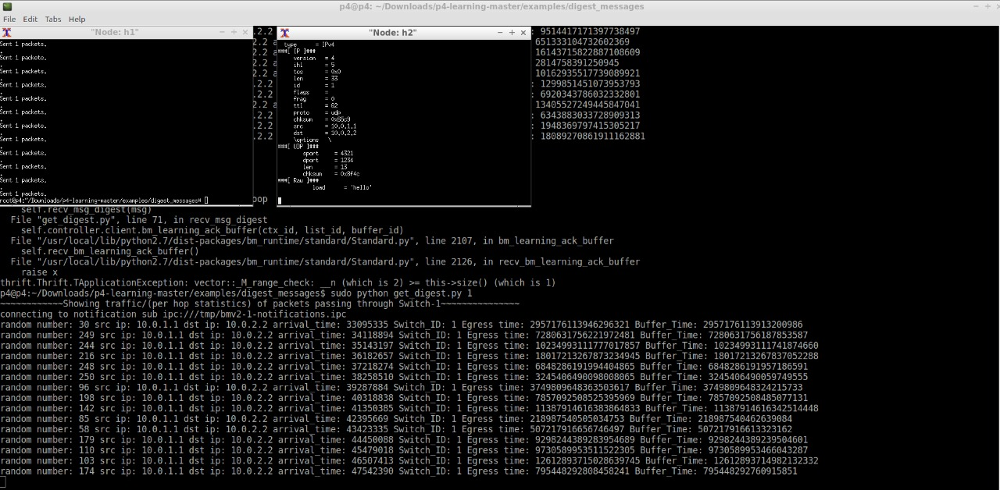

# Sending Digests to a contoller

```
                   +--+
                   |h4|
                   ++-+
                    |
                    |
+--+      +--+     ++-+     +--+
|h1+------+s1+-----+s3+-----+h3|
+--+      +-++     +--+     +--+
            |
            |
          +-++
          |s2|
          +-++
            |
            |
          +-++
          |h2|
          +--+
```

## Introduction

Similar to the [copy_to_cpu](../copy_to_cpu) example we show
how to use the bmv2 digest extern to send information to the control plane
using an out of band channel. In the digest we send a tuple with: `(random_number, src_ip, dst_ip, ingress time,egress time, buffer time)`.

## How to run

Run the topology:

```
sudo p4run
```

Run the very small controller code that receives packets from the switch:

```
sudo python get_digest.py
```

Open up the xterm for UDP traffic:

```
mininet> xterm h1 h2
```
For simple control packets:

```
mininet> h1 ping h2
```
For getting statistics

```
mininet> python stat.py
```
Result-1



Result-2


